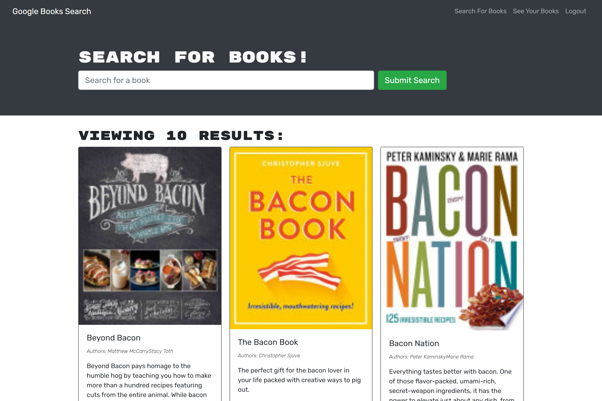
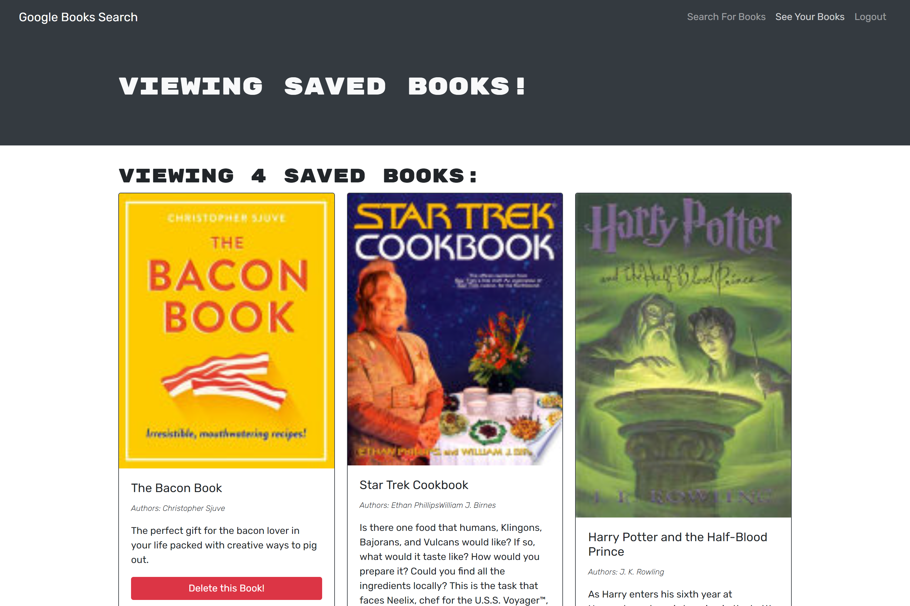

# bookSearchEngine
Find and save books you'll never read with this handy search enging!

[Live site!](https://book-search-engine-mmonyok.herokuapp.com)

## Description
- I wanted to better learn how MERN stack development works, so I built this web application.
- If you are wanting a nice concise location to store your to-do book reading list, you can you this application as it allow you to use the extensive Google Books API and save books to your user list.
- I learned a lot about JWTs, connecting the back and front of a MERN stack application, and how to debug network issues.

## Table of Contents
- [bookSearchEngine](#booksearchengine)
  - [Description](#description)
  - [Table of Contents](#table-of-contents)
  - [Installation](#installation)
  - [Usage](#usage)
  - [Credits](#credits)
  - [License](#license)
  - [Contributing](#contributing)
  - [Tests](#tests)
  - [Contact](#contact)

## Installation
1. Provided that you have a code editor of your choosing installed on your system, such as VS Code (https://code.visualstudio.com/),

2. Provided that you have a Terminal installed for Windows (https://www.microsoft.com/en-us/p/windows-terminal/9n0dx20hk701?rtc=1&activetab=pivot:overviewtab) or are using a Mac with Terminal installed with the OS,

3. Provided that you have npm and Node.js installed for windows (https://www.npmjs.com/get-npm),

4. Provided you have Git and Github Desktop installed (https://git-scm.com/downloads, https://desktop.github.com/) and have registered for an account,

5. Provided you have MongoDB and Compass installed (https://www.mongodb.com/),

6. Either Clone or Fork this repository: (https://github.com/mmonyok/bookSearchEngine.git),

7. After cloning the repository to your local computer, initialize npm, as well as install needed dependencies.

## Usage
- Use the search bar to input any subject, title, or author then click "Submit Search."
- If you would like to save books to a list you can access later, then click "Login/Sign Up" in the top right corner.
- After signing up or loggin in, there will no be a blue button at the bottom of each book that says, "Save this Book!."
- Saved books will now be in your books list, which can be access by the "See Your Books" link in the top right corner by the "Logout" button.

## Credits
- Technologies Used:
  - [HTML](https://www.w3schools.com/html/)
  - [CSS](https://www.w3schools.com/css/)
  - [JavaScript](https://www.w3schools.com/js/)
  - [The Following Node Packages:](https://www.npmjs.com/get-npm)
    - react
    - react-bootstrap
    - react-dom
    - react-router-dom
    - react-scripts
    - express
    - apollo-server-express
    - @apollo/client
    - @testing-library/jest-dom
    - @testing-library/react
    - @testing-library/user-event
    - mongoose
    - graphql
    - jsonwebtoken
    - jwt-decode
    - bcrypt
    - dotenv
    - bootstrap

- Tutorials Followed:
[Professional README guide template provided by Coding Boot Camp.](https://github.com/coding-boot-camp)

## License
MIT License

Copyright (c) [2021] [Melody Monyok]

Permission is hereby granted, free of charge, to any person obtaining a copy
of this software and associated documentation files (the "Software"), to deal
in the Software without restriction, including without limitation the rights
to use, copy, modify, merge, publish, distribute, sublicense, and/or sell
copies of the Software, and to permit persons to whom the Software is
furnished to do so, subject to the following conditions:

The above copyright notice and this permission notice shall be included in all
copies or substantial portions of the Software.

THE SOFTWARE IS PROVIDED "AS IS", WITHOUT WARRANTY OF ANY KIND, EXPRESS OR
IMPLIED, INCLUDING BUT NOT LIMITED TO THE WARRANTIES OF MERCHANTABILITY,
FITNESS FOR A PARTICULAR PURPOSE AND NONINFRINGEMENT. IN NO EVENT SHALL THE
AUTHORS OR COPYRIGHT HOLDERS BE LIABLE FOR ANY CLAIM, DAMAGES OR OTHER
LIABILITY, WHETHER IN AN ACTION OF CONTRACT, TORT OR OTHERWISE, ARISING FROM,
OUT OF OR IN CONNECTION WITH THE SOFTWARE OR THE USE OR OTHER DEALINGS IN THE
SOFTWARE.

## Contributing
- Please submit any contributions you think will improve this project.

## Tests
- No further testing is needed, unless any new contributions are made; the owner of this project will locally test any contribution submissions prior to approval.

## Contact
- Melody Monyok
  - <monyokwebdev@gmail.com>
  - (612) 492-1528